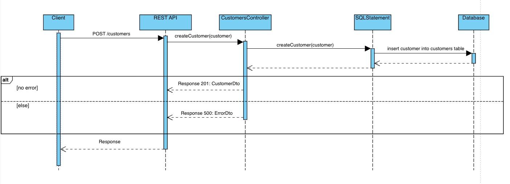

# Housefix Backend
A REST API for managing customers and readings for companies in the house management sector using this application. It is built with Java and the Jersey framework, it utilizes a MariaDB database for data storage.

---

- [Environment Variables](#environment-variables)
- [Start Service with DB using Docker](#start-service-with-db-using-docker)
- [Start Service locally without DB](#start-service-locally-without-db)
- [Service Usage](#service-usage)
- [Tests](#tests)
- [Clear Docker](#clear-docker)
- [DB Schemas](#db-schemas)
- [UML Sequence diagram](#uml-sequence-diagram)
- [Differences to the script](#differences-to-the-script)

---

## Environment Variables
Create .env file in root dir of project and fill it out
> see [.env.example](./.env.example)
> - MYSQL_ROOT_PASSWORD (password of the root user)
> - MYSQL_DATABASE (database name that should be created initially)
> - MYSQL_USER (username of the user that should be created initially)
> - MYSQL_PASSWORD (passsword of the initially created user)

## Start Service with DB using Docker
Command to Start: `docker-compose up --build -d`\
Command to Stop: `docker-compose down`
> see [Docker Compose](./docker-compose.yml)\
> see [Dockerfile](./Dockerfile)

## Start Service locally without DB
- Add the .env file in your Run Configuration (or source the env file manually)
- Correct the main [config.properties](src/main/resources/config.properties) file

## Service Usage
The Service is accessible at http://localhost:8080
> All available endpoints are listed in the [controllers](./src/main/java/eu/bsinfo/web/api)

## Tests
`mvn clean test` -> runs unit and integration tests
> Note: test [config.properties](src/test/resources/config.properties) needs to be correctly filled out and a DB on that hostname and port must be running for the integration tests!

## Clear Docker
Run: `bash clear-docker.sh`

## DB Schemas
### 💾 customers

| Column      | Type         | Constraints                                 | Description            |
|-------------|--------------|---------------------------------------------|------------------------|
| `id`        | BINARY(16)   | PRIMARY KEY                                 | Unique customer ID.    |
| `firstName` | VARCHAR(255) | NOT NULL                                    | Customer's first name. |
| `lastName`  | VARCHAR(255) | NOT NULL                                    | Customer's last name.  |
| `birthDate` | DATE         |                                             | Date of birth.         |
| `gender`    | ENUM         | (`DIVERS`, `FEMALE`, `MALE`, `UNSPECIFIED`) | Gender.                |

### 💾 readings

| Column          | Type         | Constraints                                         | Description                             |
|-----------------|--------------|-----------------------------------------------------|-----------------------------------------|
| `id`            | BINARY(16)   | PRIMARY KEY                                         | Unique reading ID.                      |
| `comment`       | TEXT         |                                                     | Additional notes.                       |
| `dateOfReading` | DATE         | NOT NULL                                            | Reading date.                           |
| `kindOfMeter`   | ENUM         | (`HEATER`, `ELECTRICITY`, `WATER`, `UNKNOWN`)       | Type of meter.                          |
| `meterCount`    | DOUBLE       | NOT NULL                                            | Meter reading value.                    |
| `meterId`       | VARCHAR(255) |                                                     | Identifier for the meter.               |
| `substitute`    | BOOLEAN      |                                                     | Indicates if it's a substitute reading. |
| `customer_id`   | BINARY(16)   | FOREIGN KEY → `CUSTOMERS(id)`, `ON DELETE SET NULL` | References customer.                    |

### 💾 users

| Column     | Type         | Constraints | Description                       |
|------------|--------------|-------------|-----------------------------------|
| `username` | VARCHAR(255) | PRIMARY KEY | Unique username.                  |
| `salt`     | TEXT         | NOT NULL    | Salt for password hashing.        |
| `password` | TEXT         | NOT NULL    | Hashed password.                  |
| `session`  | TEXT         |             | Session token for authentication. |

---

## UML Sequence diagram

## Differences to the script
Gender: `["DIVERS", "MALE", "FEMALE", "UNSPECIFIED"]`\
KindOfMeter: `["HEATER", "ELECTRICITY", "WATER", "UNKNOWN"]`
